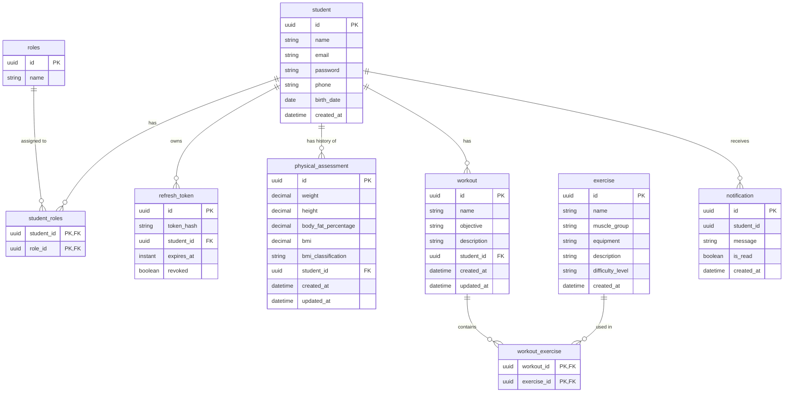

<div align="center">

# 🌱 SpringFit

*A modern REST API for managing gyms, students, and workouts with Spring Boot.*


---

📃 [About](#-about)&nbsp;&nbsp;•&nbsp;&nbsp;
🛠️ [Technologies](#-technologies)&nbsp;&nbsp;•&nbsp;&nbsp;
✨ [Features](#-features)&nbsp;&nbsp;•&nbsp;&nbsp;
🚀 [Getting Started](#-getting-started)&nbsp;&nbsp;•&nbsp;&nbsp;
🧪 [Tests](#-tests)&nbsp;&nbsp;•&nbsp;&nbsp;
⚙️ [CI/CD](#-cicd)&nbsp;&nbsp;•&nbsp;&nbsp;
📖 [API Documentation](#-api-documentation)

</div>

---

## 📃 About

**SpringFit** is a REST API for gym management built with **Spring Boot** and **Spring Security**. It allows you to
register students, create personalized workouts, manage exercises by muscle group, and record physical assessments.

The API features **JWT** authentication with **refresh token rotation**, role-based access control, **event-driven
notifications** powered by **RabbitMQ**, automated tests, a **GitHub Actions** CI pipeline, and interactive
documentation powered by **Swagger**.

---

## 🛠️ Technologies

- ☕ **[Java 17](https://www.oracle.com/java/)** — Main programming language.
- 🌱 **[Spring Boot 4](https://spring.io/projects/spring-boot)** — Framework for building modern Java applications.
- 🔐 **[Spring Security](https://spring.io/projects/spring-security)** — Authentication and access control.
- 🗃️ **[Spring Data JPA](https://spring.io/projects/spring-data-jpa)** — Data access abstraction with Hibernate.
- 🐇 **[RabbitMQ](https://www.rabbitmq.com/) + [Spring AMQP](https://spring.io/projects/spring-amqp)** — Asynchronous
  messaging and event-driven notifications.
- 🐬 **[MySQL 8](https://www.mysql.com/)** — Relational database used in production.
- 🗄️ **[H2](https://www.h2database.com/)** — In-memory database for local development and automated tests.
- 🔑 **[JJWT](https://github.com/jwtk/jjwt)** — JWT token generation and validation.
- 📖 **[SpringDoc OpenAPI](https://springdoc.org/)** — Interactive API documentation via Swagger UI.
- 🏗️ **[Lombok](https://projectlombok.org/)** — Boilerplate reduction through code generation.
- ✅ **[Bean Validation](https://beanvalidation.org/)** — Input data validation.
- 📦 **[Maven](https://maven.apache.org/)** — Dependency management and build automation (via Maven Wrapper).
- 🐳 **[Docker Compose](https://www.docker.com/)** — MySQL and RabbitMQ containers for a reproducible environment.
- ⚙️ **[GitHub Actions](https://github.com/features/actions)** — Continuous integration, PR validation and automatic
  labeling.
- 🤖 **[Dependabot](https://docs.github.com/en/code-security/dependabot)** — Automated dependency updates.
- 🧪 **[JUnit 5](https://junit.org/junit5/)** — Test framework.
- 🎭 **[Mockito](https://site.mockito.org/)** — Mocking dependencies in unit tests.
- 🔎 **[AssertJ](https://assertj.github.io/doc/)** — Fluent assertions.
- 🌿 **[Spring Boot Test](https://docs.spring.io/spring-boot/reference/testing/index.html)** — Application context tests
  with a dedicated `test` profile.

---

## ✨ Features

### 🔐 Authentication & Security

- [x] JWT authentication (register and login)
- [x] Refresh tokens with **rotation** (each refresh issues a new token and revokes the old one)
- [x] **Reuse detection** — using an already revoked refresh token revokes all tokens of that user
- [x] Refresh tokens stored as **SHA-256 hashes** (the raw token is never persisted)
- [x] Logout endpoint (revokes the refresh token)
- [x] Scheduled job that cleans up expired refresh tokens daily
- [x] Passwords hashed with BCrypt
- [x] Role-based access control (`ADMIN` and `STUDENT`)
- [x] Ownership checks with `@PreAuthorize` (students can only access their own data)

### 🏋️ Gym Management

- [x] Student registration, update and removal
- [x] Personalized workout creation per student
- [x] Exercise management by muscle group (with default difficulty level)
- [x] Protection against deleting exercises that belong to workouts
- [x] Physical assessment registration with automatic **BMI** calculation and classification
- [x] Assessment listing with projections and **pagination**
- [x] Students can only view their own physical assessments

### 📨 Event-Driven Notifications

- [x] `PhysicalAssessmentCreatedEvent` published to RabbitMQ when an assessment is created
- [x] Listener that turns each event into a student notification
- [x] Notification listing and "mark as read" endpoints
- [x] Retry with exponential backoff and a **Dead Letter Queue** for failed messages

### 🧰 Quality & Developer Experience

- [x] Global exception handler with standardized error responses
- [x] Detailed validation error responses (field + message)
- [x] Data seeder with an admin, a student and sample exercises
- [x] Unit tests for the service layer and application context test
- [x] CI pipeline with GitHub Actions
- [x] Semantic PR titles and automatic PR labeling
- [x] Interactive documentation with Swagger UI

---

## 🏛️ Architecture

### 📁 Project Structure

```text
src/main/java/br/com/joschonarth/springfit
├── config/        # Security, JWT, OpenAPI, RabbitMQ and data seeder
├── controller/    # REST controllers
├── service/       # Business logic
├── database/
│   ├── model/     # JPA entities
│   └── repository/# Spring Data repositories
├── dto/
│   ├── request/   # Request bodies
│   ├── response/  # Response bodies
│   ├── projection/# Interface-based projections
│   └── event/     # Messaging events
├── listener/      # RabbitMQ listeners
├── job/           # Scheduled jobs
├── enums/         # Domain enums
├── exception/     # Custom exceptions and error responses
└── handler/       # Global exception handler
```

---

## 🗄️ Database Diagram



---

## 🚀 Getting Started

### 📋 Prerequisites

- ☕ [Java 17+](https://www.oracle.com/java/)
- 📦 [Maven](https://maven.apache.org/) (optional — the Maven Wrapper is included)
- 🐳 [Docker](https://www.docker.com/)

### 🔧 Installation

1. Clone the repository:

    ```bash
    git clone https://github.com/joschonarth/spring-fit.git
    ```

2. Navigate to the project folder:

    ```bash
    cd spring-fit
    ```

3. (Optional) Configure environment variables. Defaults are defined in `src/main/resources/application.yaml`:

   | Variable | Default | Description |
   | --- | --- | --- |
   | `DB_USERNAME` | `docker` | Database user |
   | `DB_PASSWORD` | `docker` | Database password |
   | `RABBITMQ_HOST` | `localhost` | RabbitMQ host |
   | `RABBITMQ_PORT` | `5672` | RabbitMQ port |
   | `RABBITMQ_USERNAME` | `docker` | RabbitMQ user |
   | `RABBITMQ_PASSWORD` | `docker` | RabbitMQ password |
   | `JWT_KEY` | *(development key)* | Secret used to sign JWTs |
   | `JWT_EXPIRATION` | `900000` | Access token lifetime in ms (15 minutes) |
   | `JWT_REFRESH_EXPIRATION` | `604800000` | Refresh token lifetime in ms (7 days) |

   > ⚠️ **Always set your own `JWT_KEY` in production.** The default value is meant for local development only.

### 🐳 Infrastructure (MySQL + RabbitMQ)

Start both containers with Docker Compose:

```bash
docker compose up -d
```

| Service                | Port    | Credentials         |
|------------------------|---------|---------------------|
| MySQL                  | `3306`  | `docker` / `docker` |
| RabbitMQ (AMQP)        | `5672`  | `docker` / `docker` |
| RabbitMQ Management UI | `15672` | `docker` / `docker` |

### 🗄️ Alternative Database (H2)

If you prefer to use the in-memory **H2** database instead of MySQL, comment out the MySQL block and uncomment the H2
block in `src/main/resources/application.yaml`:

```yaml
# H2 In-Memory Database
datasource:
  url: jdbc:h2:mem:testdb
  driver-class-name: org.h2.Driver
  username: sa
  password:
h2:
  console:
    enabled: true
    path: /h2-console
```

With H2 enabled, the console will be available at **[http://localhost:8080/h2-console](http://localhost:8080/h2-console)
**.

> 💡 H2 replaces only the database. **RabbitMQ is still required** for the physical assessment notification flow, so you
> can start just that service with `docker compose up -d rabbitmq`.

### ▶️ Running

Start the application with Maven:

```bash
./mvnw spring-boot:run
```

The API will be available at **[http://localhost:8080](http://localhost:8080)**.

### 🌱 Seeded Data

On first startup (when the database is empty), `DataSeeder` creates default roles, users and exercises:

| Role      | Email                 | Password   |
|-----------|-----------------------|------------|
| `ADMIN`   | `admin@example.com`   | `admin123` |
| `STUDENT` | `johndoe@example.com` | `john123`  |

It also creates 5 sample exercises (Bench Press, Pull Up, Squat, Shoulder Press and Bicep Curl).

> ⚠️ These credentials are for development only. Remove or change the seeder before deploying.

---

## 🧪 Tests

The project includes automated tests built with **JUnit 5**, **Mockito** and **AssertJ**:

- **Unit tests** for the service layer (e.g. `ExerciseServiceTest`), using mocked repositories and grouped with
  `@Nested` classes.
- **Application context test** (`SpringFitApplicationTests`) running with the `test` profile, which uses an in-memory H2
  database (`application-test.yml`).

Run all tests:

```bash
./mvnw test
```

Run the full verification (the same command used by the CI):

```bash
./mvnw clean verify
```

Test reports are generated in `target/surefire-reports/`.

---

## ⚙️ CI/CD

The repository uses **GitHub Actions** (workflows in `.github/workflows`):

| Workflow                            | Trigger                                            | Description                                                                                                                                |
|-------------------------------------|----------------------------------------------------|--------------------------------------------------------------------------------------------------------------------------------------------|
| **Build** (`build.yml`)             | Push / PR to `main` and `develop`, manual dispatch | Sets up JDK 17 (Temurin) with Maven cache, runs `./mvnw clean verify` and uploads the Surefire test report as an artifact                  |
| **PR Title Check** (`pr-title.yml`) | PR opened / edited / synchronized                  | Validates PR titles against [Conventional Commits](https://www.conventionalcommits.org/) (subject must not start with an uppercase letter) |
| **PR Labeler** (`pr-labeler.yml`)   | PR opened / edited / synchronized                  | Automatically labels PRs based on the conventional commit type (`feat` → `enhancement`, `fix` → `bug`, `docs` → `documentation`, etc.)     |

**Dependabot** is configured to check Maven and GitHub Actions dependencies weekly, opening PRs with `chore` and `ci`
commit prefixes.

### 📝 Commit / PR Convention

PR titles follow Conventional Commits. Accepted types: `feat`, `fix`, `docs`, `style`, `refactor`, `perf`, `test`,
`build`, `ci`, `chore`, `revert` and `deps`.

```text
feat(workout): add endpoint to list workouts by student
fix: handle expired refresh token
```

---

## 📖 API Documentation

With the application running, access the interactive documentation generated by Swagger UI:

**[http://localhost:8080/swagger-ui/index.html](http://localhost:8080/swagger-ui/index.html)**

> 💡 To test protected endpoints, click **Authorize** and paste the JWT access token obtained at login (the `Bearer`
> scheme is handled by Swagger UI).

## ⭐ Support this Project

If you liked this project, leave a ⭐ on GitHub — it means a lot!

---

<div align="center">

Made with ♥ by **[João Otávio Schonarth](https://github.com/joschonarth)**

[](https://github.com/joschonarth)
[](https://linkedin.com/in/joschonarth)
[](mailto:joschonarth@gmail.com)

</div>
